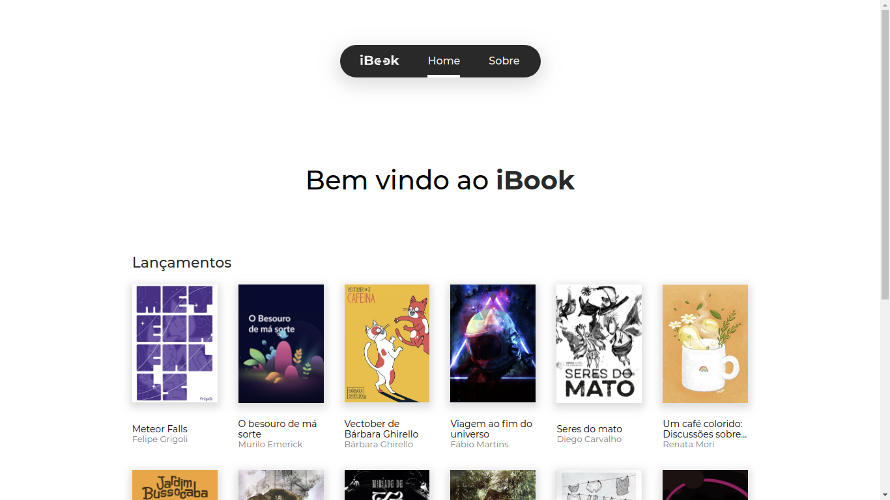
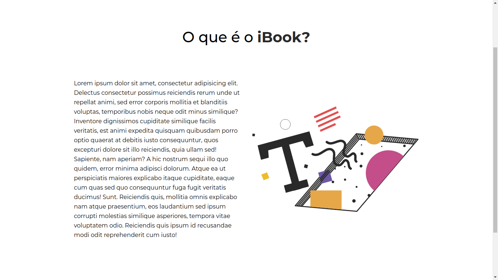
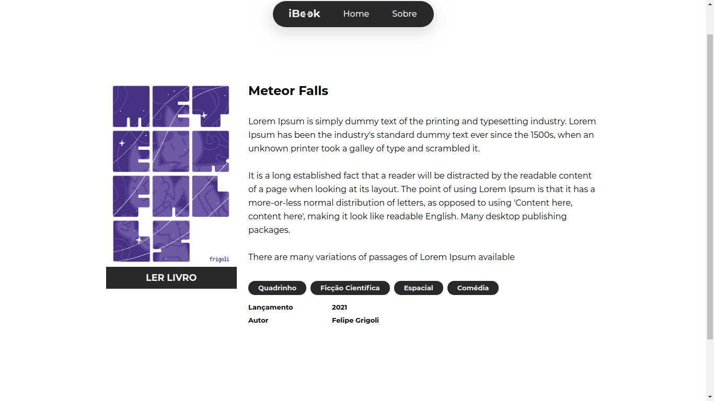
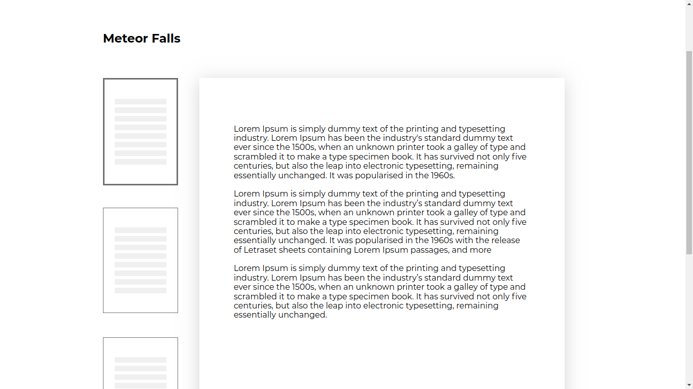
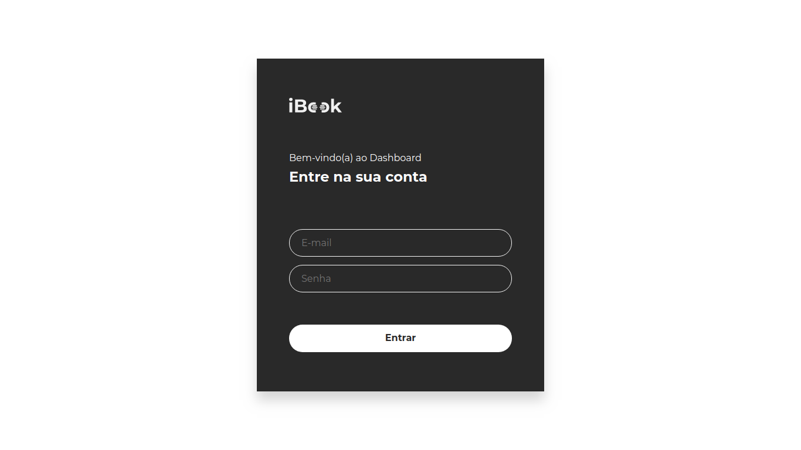
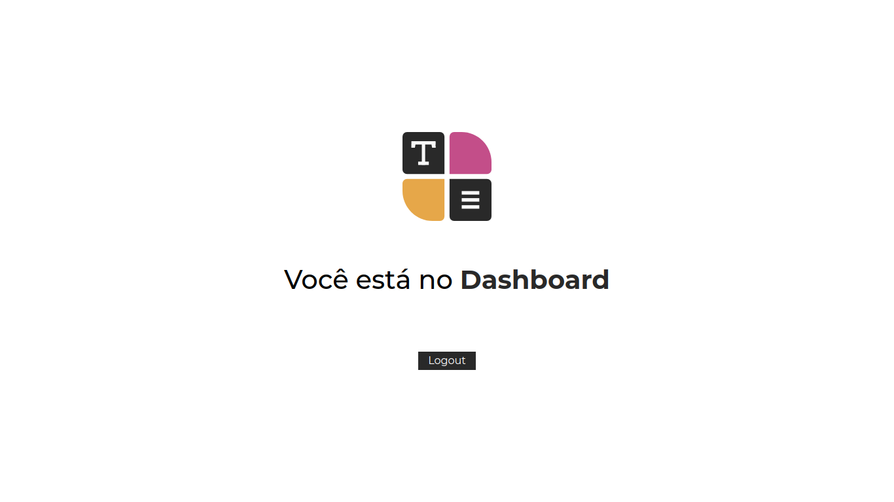
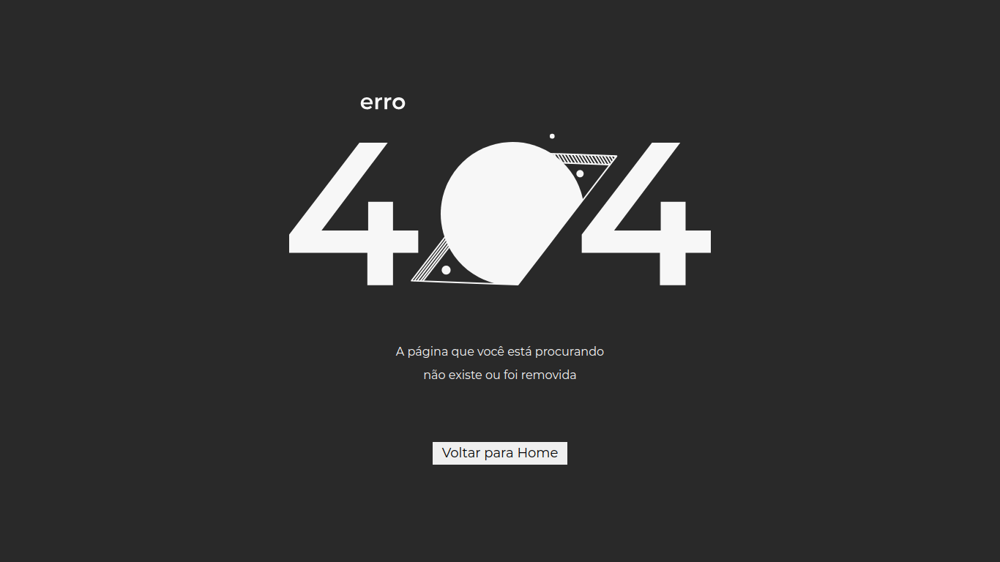

<h1 align="center">iBook</h1>
<p align="center">Este projeto foi construído no Bootcamp da Cataline como desafio do curso de NuxtJS, sinta-se a vontade para usá-lo você também :). Antes de rodar essa aplicação na sua máquina, siga a <a href="https://github.com/cataline4learning/ibook-api">documentação da api</a>  e execute-a.</p>



No curso de NuxtJS aprendemos:
 * Auto Import de Components aplicando Atomic Design.
 * NuxtJS Layouts e rotas de erro customizadas.
 * NuxtJS Middleware.
 * NuxtJS Pages e roteamento.
 * NuxtJS Plugins.
 * SSR com NuxtJS.
 * Uso do Vuex com TypeScript no NuxtJS.
 * SEO e Tag Heads.

<h2 align="center">Apresentando o projeto</h2>



O iBook é um projeto de leitura de livros on-line, com uma enxuta e amigável interface.
Pode conferir o UI/UX em: <a href="https://xd.adobe.com/view/178258a2-beb1-431b-8067-afc22ad867b3-42d1/">Abrir Adobe XD</a>.




<h2 align="center">Autenticação e rotas protegidas</h2>

Com o recurso Middleware do NuxtJS, criamos como desafio uma rota autenticada com direito a login e logout, caso queira testar a api tem um usuário de teste:

```json
{
  email: "caty@cataline.io",
  password: "abc123"
}
```



<h2 align="center">Página de Erro</h2>

As vezes o usuário tem uma busca inexistente no site, e precisamos retornar uma página de erro, usando o NuxtJS Layouts, resolvemos o problema.



<h2 align="center">Executando localmente</h2>

```bash
# Clonando o projeto
git clone https://github.com/code-pisces/cataline-bootcamp-nuxtjs

# Entrando e instalando dependências
cd cataline-bootcamp-nuxtjs && yarn

# Rodando o server
yarn dev
```

<p align="center">Feito por Gustavo Amorim no Bootcamp da Cataline.</p>
